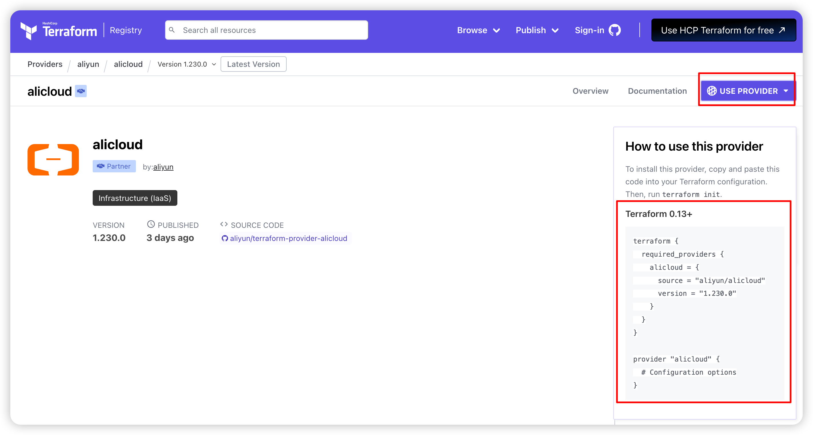
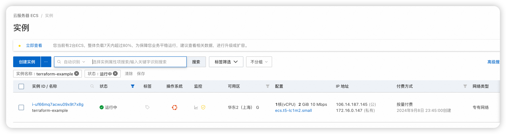
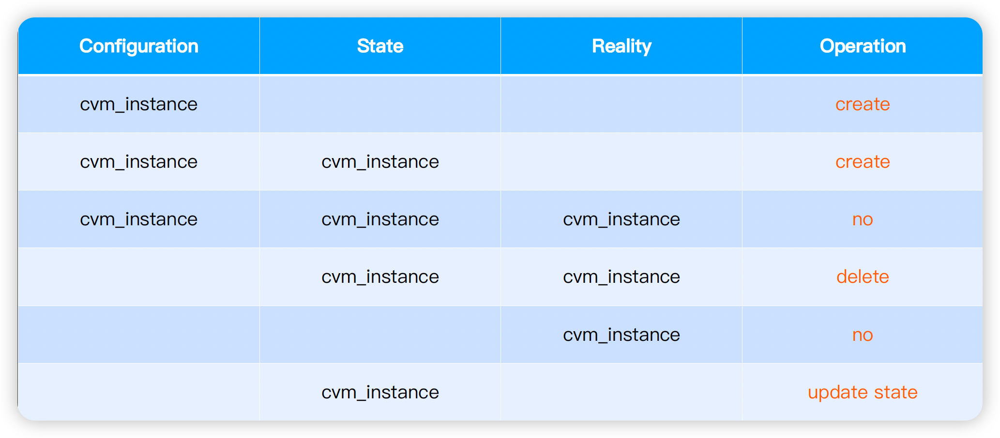
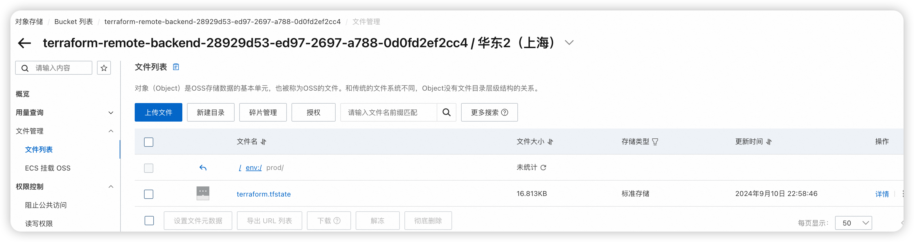

# aiops

## Terraform 架构

---
**Tips:**
- Terraform Provider大部分云厂商已经支持：[providers](https://registry.terraform.io/browse/providers)

- Terraform Provider建议固定版本：~> version


### demo1
>创建/删除一台阿里云ECS（Terraform State File存储在本地）

1. 安装 Terraform：[install](https://developer.hashicorp.com/terraform/downloads)

```shell
#Ubuntu/Debian
wget -O hashicorp-key.gpg https://apt.releases.hashicorp.com/gpg
cat hashicorp-key.gpg |gpg --dearmor -o /usr/share/keyrings/hashicorp-archive-keyring.gpg
echo "deb [signed-by=/usr/share/keyrings/hashicorp-archive-keyring.gpg] https://apt.releases.hashicorp.com $(lsb_release -cs) main" | sudo tee /etc/apt/sources.list.d/hashicorp.list
apt update &&   apt install terraform
rm hashicorp-key.gpg 
```
---
2. 认证配置（aliyun）

创建一个RAM用户，赋予了ECS\VPC的相关权限，得到了
**AccessKey ID和AccessKey Secret**

---
3. 开通虚拟机（aliyun） [参考](https://help.aliyun.com/document_detail/95829.html?spm=a2c4g.2588840.0.0.52f867040U8tfr)

*3.1 指定provider的版本*


```shell
terraform {
  required_providers {
    alicloud = {
      source = "aliyun/alicloud"
      version = "1.230.0"
    }
  }
}
```
---
*3.2 配置阿里云账号信息*

默认：
```
provider "alicloud" {
  access_key = var.access_key
  secret_key = var.secret_key
  # If not set, cn-beijing will be used.
  region = var.region
}
```

我使用这个：

**Shared Credentials File**

将AK保存到本地$HOME/.aliyun/config.json [参考](https://www.alibabacloud.com/help/zh/cli/configure-credentials#2a8d7a54cervl)

```shell
{
	"current": "TFAkProfile",
	"profiles": [
		{
			"name": "TFAkProfile",
			"mode": "AK",
			"access_key_id": "********",
			"access_key_secret": "************",
			"expired_seconds": 0,
			"region_id": "cn-shanghai",
			"output_format": "json",
			"language": "en",
			"retry_timeout": 0,
			"connect_timeout": 0,
			"retry_count": 0
		}
	],
	"meta_path": ""
}
```


```shell
provider "alicloud" {
  region                  = "cn-shanghai"
  shared_credentials_file = "/root/.aliyun/config.json"
  profile                 = "TFAkProfile"
}
```

或者可以使用：

**Environment variables**
```
export ALIBABA_CLOUD_ACCESS_KEY_ID="<Your-Access-Key-ID>"
export ALIBABA_CLOUD_ACCESS_KEY_SECRET="<Your-Access-Key-Secret>"
export ALIBABA_CLOUD_REGION="cn-shanghai"
```
---

*3.3 创建虚拟机*


3.3.1 下载指定版本的provider
```shell
root@devops-shawn-workspace:~/geekbang/aiops/module_2/demo1# terraform init

Terraform has been successfully initialized!
#产生锁文件并且下载了provider
module_2      
└─ demo1      
   └─ cvm.tf  

   └─ .terraform.lock.hcl
      
   └─ .terraform                                                 
      └─ providers                                               
         └─ registry.terraform.io                                
            └─ aliyun                                            
               └─ alicloud                                       
                  └─ 1.230.0                                     
                     └─ linux_amd64                              
                        └─ terraform-provider-alicloud_v1.230.0  


```
# tips
1. 直接用本地的provider，不用下载远程的provider
terraform init --plugin-dir .terraform/providers
2. 如果增加、修改或更新了依赖，都需要重新执行 init

---
3.3.2 生成执行计划 
> (不执行)，相当于dry-run
```shell
root@devops-shawn-workspace:~/geekbang/aiops/module_2/demo1# terraform plan
data.alicloud_zones.default: Reading...
data.alicloud_zones.default: Read complete after 2s [id=1880110974]

Terraform used the selected providers to generate the following execution plan. Resource actions are indicated with the following symbols:
  + create

Terraform will perform the following actions:
....

Plan: 5 to add, 0 to change, 0 to destroy.


# 查看执行计划Terraform State File:  terraform.tfstate 
# 记录了真实所有云资源的状态，包括敏感信息
# 默认存储在本地，也可以存储在远端
{
  "version": 4,
  "terraform_version": "1.9.5",
  "serial": 14,
  "lineage": "18296eb8-1b40-4f72-0f0b-ef80ada9252c",
  "outputs": {},
  "resources": [
    {
      "mode": "data",
      "type": "alicloud_zones",
      "name": "default",
      "provider": "provider[\"registry.terraform.io/aliyun/alicloud\"]",
      "instances": [
        {
          "schema_version": 0,
          "attributes": {
            "available_disk_category": "cloud_efficiency",
            "available_instance_type": null,
            "available_resource_creation": "VSwitch",
            ......
```
---
3.3.3 执行
```shell
root@devops-shawn-workspace:~/geekbang/aiops/module_2/demo1# terraform apply -auto-approve
```

```shell
root@devops-shawn-workspace:~/geekbang/aiops/module_2/demo1# ssh root@public_ip
Welcome to Ubuntu 18.04.2 LTS (GNU/Linux 4.15.0-52-generic x86_64)

 * Documentation:  https://help.ubuntu.com
 * Management:     https://landscape.canonical.com
 * Support:        https://ubuntu.com/advantage

New release '20.04.6 LTS' available.
Run 'do-release-upgrade' to upgrade to it.


Welcome to Alibaba Cloud Elastic Compute Service !

Last login: Mon Sep  9 13:51:28 2024 from x.x.x.x
root@iZuf64m0c7fw396kcd3ckkZ:~# 
```
---
3.3.4 删除 
> terraform.tfstate 会被清空了 而且 真实云资源也删除了
```
root@devops-shawn-workspace:~/geekbang/aiops/module_2/demo1# terraform destroy -auto-approve

```
---


### demo2
>导入资源

>使用场景

>1.资源一开始并不是由 terraform 创建的

>2.state 状态丢失需要重新拉取真实的状态

terraform configuration  、 terraform state 、 reality resource 有差异时，最终会产生什么操作？



---
1. 确保当前有一个ECS实例,拿到实际的实例ID
```shell
root@devops-shawn-workspace:~/geekbang/aiops/module_2# cp -ra demo1 demo2
root@devops-shawn-workspace:~/geekbang/aiops/module_2# cd demo2/
root@devops-shawn-workspace:~/geekbang/aiops/module_2/demo2# rm terraform.tfstate
root@devops-shawn-workspace:~/geekbang/aiops/module_2/demo2# terraform plan
root@devops-shawn-workspace:~/geekbang/aiops/module_2/demo2# terraform apply -auto-approve
#拿到实际的实例ID:i-uf64m0c7fw396kcd3ckk
root@devops-shawn-workspace:~/geekbang/aiops/module_2/demo2# terraform show 
```
---
2. 备份demo2的state文件
```shell

#模拟state 丢失
root@devops-shawn-workspace:~/geekbang/aiops/module_2/demo2# mv terraform.tfstate terraform.tfstate.backup
```

---
3. 导入demo2的ECS实例来恢复state
```shell
terraform import alicloud_instance.instance i-uf64m0c7fw396kcd3ckk

#对比新的state和备份的state的差异

```

### demo3
>1. 使用 Local 存储，并定义远端的 oss 对象存储

>2. 将状态文件迁移到 COS


---
1. 阿里云中赋予AK关于oss和ots(Tablestore)的必要权限  [参考oss backend](https://help.aliyun.com/document_detail/145541.html)

---
2. 创建oss和ots(Tablestore)，生成terraform backend oss的tf配置

```shell
root@devops-shawn-workspace:~/geekbang/aiops/module_2/demo3_oss_backend# terraform init
root@devops-shawn-workspace:~/geekbang/aiops/module_2/demo3_oss_backend# terraform plan
root@devops-shawn-workspace:~/geekbang/aiops/module_2/demo3_oss_backend# terraform apply -auto-approve

#terraform show 可以查看oss和ots(Tablestore)已经创建
root@devops-shawn-workspace:~/geekbang/aiops/module_2/demo3_oss_backend# terraform show

#生成了terraform backend oss的tf配置
terraform {
  backend "oss" {
    bucket              = "terraform-remote-backend-28929d53-ed97-2697-a788-0d0fd2ef2cc4"
    prefix              = ""
    key                 = "prod/terraform.tfstate"
    acl                 = "private"
    region              = "cn-shanghai"
    encrypt             = "true"
    tablestore_endpoint = "https://ots-i-87169.cn-shanghai.ots.aliyuncs.com"
    tablestore_table    = "terraform_remote_backend_lock_table_28929d53_ed97_2697_a788_0d0fd2ef2cc4"
  }
}

```
---

3. 在demo3中配置remote backend：oss

```shell
terraform {
  backend "oss" {
    profile                 = "TFAkProfile" 
    # 指定profile= Credentials File 或者 
    #access_key          = "xxxxxxxx"
    #secret_key          = "xxxxxxxx"
    bucket              = "terraform-remote-backend-28929d53-ed97-2697-a788-0d0fd2ef2cc4"
    key                 = "prod/terraform.tfstate"
    acl                 = "private"
    region              = "cn-shanghai"
    encrypt             = "true"
    tablestore_endpoint = "https://ots-i-87169.cn-shanghai.ots.aliyuncs.com"
    tablestore_table    = "terraform_remote_backend_lock_table_28929d53_ed97_2697_a788_0d0fd2ef2cc4"
  }
}
```


```shell
root@devops-shawn-workspace:~/geekbang/aiops/module_2# cp -ra demo2 demo3
root@devops-shawn-workspace:~/geekbang/aiops/module_2# cd demo3/
root@devops-shawn-workspace:~/geekbang/aiops/module_2/demo3# rm terraform.tfstate


root@devops-shawn-workspace:~/geekbang/aiops/module_2/demo3# terraform init
root@devops-shawn-workspace:~/geekbang/aiops/module_2/demo3# terraform plan
root@devops-shawn-workspace:~/geekbang/aiops/module_2/demo3# terraform apply -auto-approve
```


---
Tips：
关于 State 的其他命令
• terraform refresh：从基础设施实际状态更新 state 状态
• terraform state list：列出 state 记录的资源
• terraform state rm：删除某些 state 状态
• terraform state pull：从远端拉取状态到本地
• terraform state push：更新本地的状态到远端


---
Terraform Layout（推荐）

.
├── README.md
├── main.tf：主要的业务逻辑 定义基础设施可以拆开，cvm.tf、helm.tf、k3s.tf
├── outputs.tf：定义输出内容 定义运行结束后所需要输出的内容 可设置是否为敏感数据，敏感数据将不输出 可以引用其他的 resource 的输出内容
├── variables.tf：定义变量参数 用于在代码中引用 可定义类型、默认值、描述、验证函数、是否敏感数据（不在 plan 中显示）
└── version.tf：定义依赖和版本


---
如何设置 variables？
1. 通过在命令行配置：terraform apply -var="prefix=values"
2. 指定配置文件：terraform apply -var-file="testing.tfvars"
3. 环境变量：export TF_VAR_prefix=values
4. 定义的默认值
5. 交互式输入
优先级从上（1最高）到下（5最低）对值进行覆盖。
---
### demo4
• 开通 VM
• 安装 K3s
• 安装 Argo CD
• 查看依赖关系：terraform graph | dot -Tsvg > graph.svg

