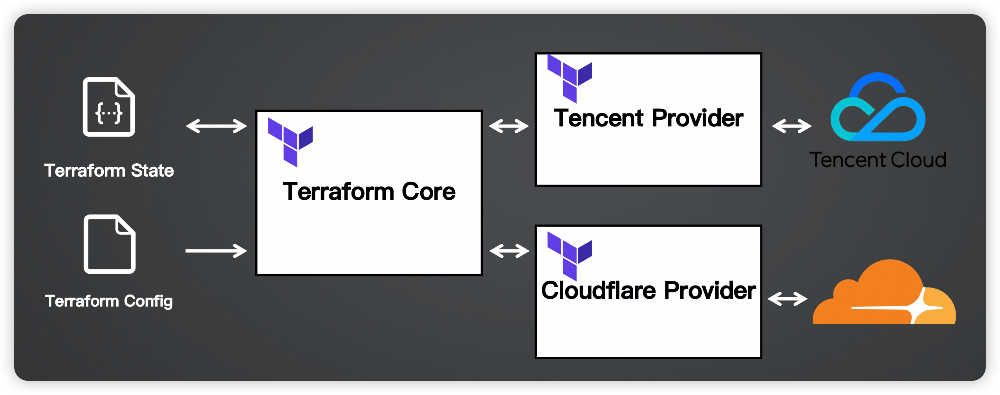

# aiops

## Terraform 架构

---
**Tips:**
- Terraform Provider大部分云厂商已经支持：[providers](https://registry.terraform.io/browse/providers)

- Terraform Provider建议固定版本：~> version


### demo1
>创建/删除一台阿里云ECS（Terraform State File存储在本地）

1. 安装 Terraform：[install](https://developer.hashicorp.com/terraform/downloads)

```shell
#Ubuntu/Debian
wget -O hashicorp-key.gpg https://apt.releases.hashicorp.com/gpg
cat hashicorp-key.gpg |gpg --dearmor -o /usr/share/keyrings/hashicorp-archive-keyring.gpg
echo "deb [signed-by=/usr/share/keyrings/hashicorp-archive-keyring.gpg] https://apt.releases.hashicorp.com $(lsb_release -cs) main" | sudo tee /etc/apt/sources.list.d/hashicorp.list
apt update &&   apt install terraform
rm hashicorp-key.gpg 
```
---
2. 认证配置（aliyun）

创建一个RAM用户，赋予了ECS\VPC的相关权限，得到了
**AccessKey ID和AccessKey Secret**

---
3. 开通虚拟机（aliyun）

*3.1 指定provider的版本*


```shell
terraform {
  required_providers {
    alicloud = {
      source = "aliyun/alicloud"
      version = "1.230.0"
    }
  }
}
```
---
*3.2 配置阿里云账号信息*

默认：
```
provider "alicloud" {
  access_key = var.access_key
  secret_key = var.secret_key
  # If not set, cn-beijing will be used.
  region = var.region
}
```

我使用这个：

**Shared Credentials File**

将AK保存到本地$HOME/.aliyun/config.json [参考](https://www.alibabacloud.com/help/zh/cli/configure-credentials#2a8d7a54cervl)

```shell
{
	"current": "TFAkProfile",
	"profiles": [
		{
			"name": "TFAkProfile",
			"mode": "AK",
			"access_key_id": "********",
			"access_key_secret": "************",
			"expired_seconds": 0,
			"region_id": "cn-shanghai",
			"output_format": "json",
			"language": "en",
			"retry_timeout": 0,
			"connect_timeout": 0,
			"retry_count": 0
		}
	],
	"meta_path": ""
}
```


```shell
provider "alicloud" {
  region                  = "cn-shanghai"
  shared_credentials_file = "/root/.aliyun/config.json"
  profile                 = "TFAkProfile"
}
```

或者可以使用：

**Environment variables**
```
export ALIBABA_CLOUD_ACCESS_KEY_ID="<Your-Access-Key-ID>"
export ALIBABA_CLOUD_ACCESS_KEY_SECRET="<Your-Access-Key-Secret>"
export ALIBABA_CLOUD_REGION="cn-shanghai"
```
---

*3.3 创建虚拟机*


3.3.1 下载指定版本的provider
```shell
root@devops-shawn-workspace:~/geekbang/aiops/module_2/demo1# terraform init

Terraform has been successfully initialized!
#产生锁文件并且下载了provider
module_2      
└─ demo1      
   └─ cvm.tf  

   └─ .terraform.lock.hcl
      
   └─ .terraform                                                 
      └─ providers                                               
         └─ registry.terraform.io                                
            └─ aliyun                                            
               └─ alicloud                                       
                  └─ 1.230.0                                     
                     └─ linux_amd64                              
                        └─ terraform-provider-alicloud_v1.230.0  


```
# tips
1. 直接用本地的provider，不用下载远程的provider
terraform init --plugin-dir .terraform/providers
2. 如果增加、修改或更新了依赖，都需要重新执行 init

---
3.3.2 生成执行计划 
> (不执行)，相当于dry-run
```shell
root@devops-shawn-workspace:~/geekbang/aiops/module_2/demo1# terraform plan
data.alicloud_zones.default: Reading...
data.alicloud_zones.default: Read complete after 2s [id=1880110974]

Terraform used the selected providers to generate the following execution plan. Resource actions are indicated with the following symbols:
  + create

Terraform will perform the following actions:
....

Plan: 5 to add, 0 to change, 0 to destroy.


# 查看执行计划Terraform State File:  terraform.tfstate 
# 记录了真实所有云资源的状态，包括敏感信息
# 默认存储在本地，也可以存储在远端
{
  "version": 4,
  "terraform_version": "1.9.5",
  "serial": 14,
  "lineage": "18296eb8-1b40-4f72-0f0b-ef80ada9252c",
  "outputs": {},
  "resources": [
    {
      "mode": "data",
      "type": "alicloud_zones",
      "name": "default",
      "provider": "provider[\"registry.terraform.io/aliyun/alicloud\"]",
      "instances": [
        {
          "schema_version": 0,
          "attributes": {
            "available_disk_category": "cloud_efficiency",
            "available_instance_type": null,
            "available_resource_creation": "VSwitch",
            ......
```
---
3.3.3 执行
```shell
root@devops-shawn-workspace:~/geekbang/aiops/module_2/demo1# terraform apply -auto-approve
```

---
3.3.4 删除 
> terraform.tfstate 会被清空了 而且 真实云资源也删除了
```
root@devops-shawn-workspace:~/geekbang/aiops/module_2/demo1# terraform destroy -auto-approve

```
---

