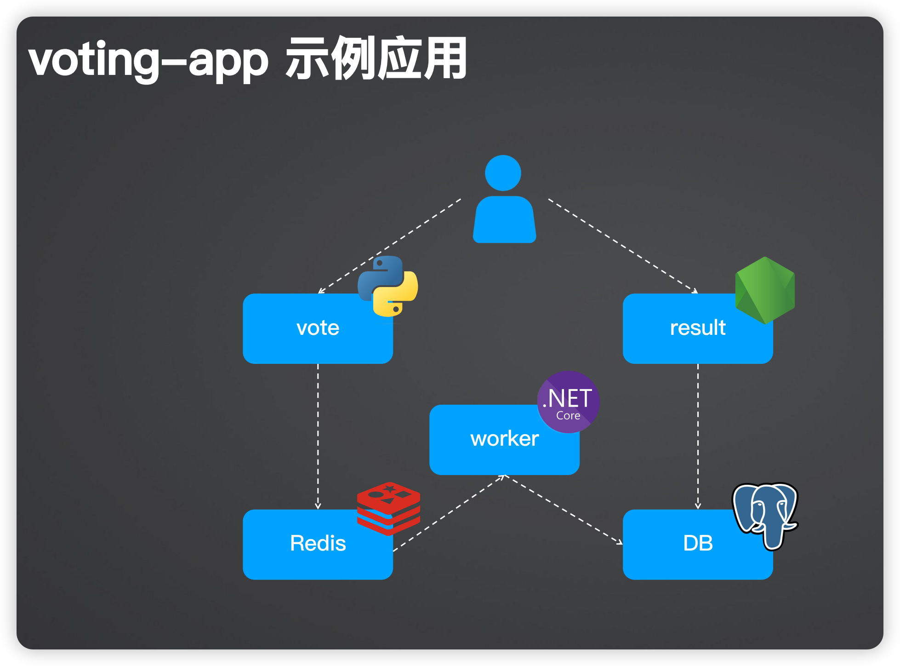
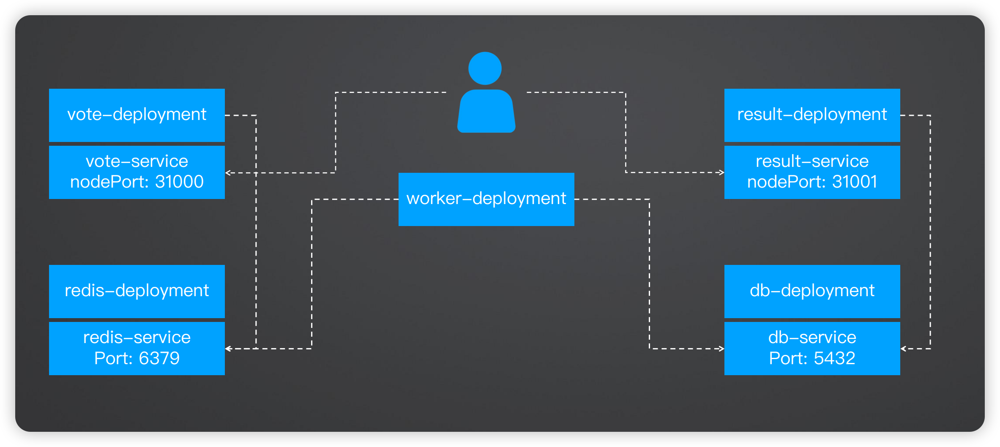
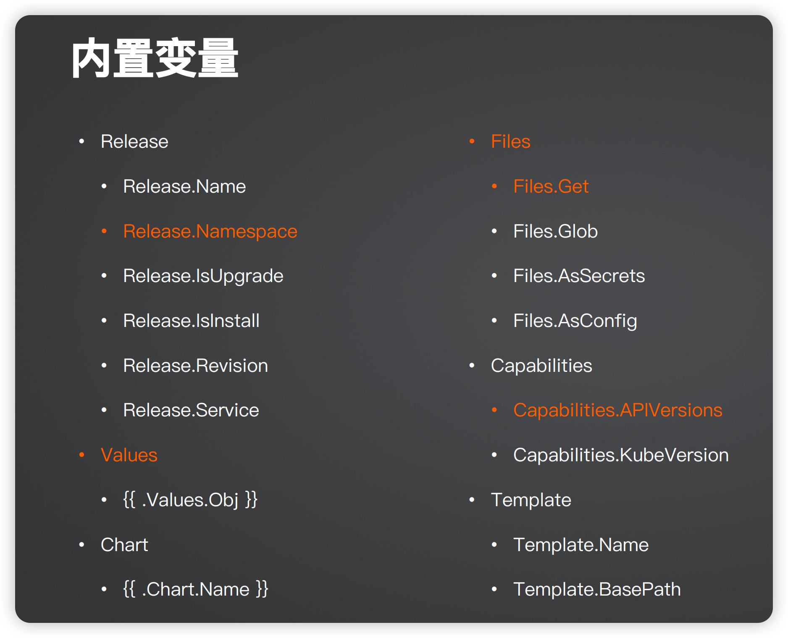
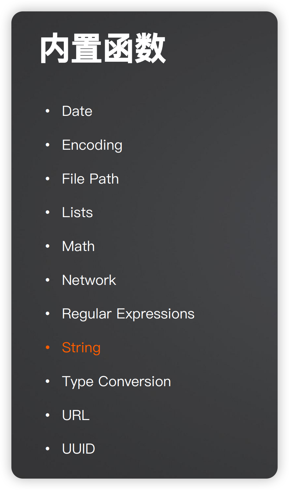
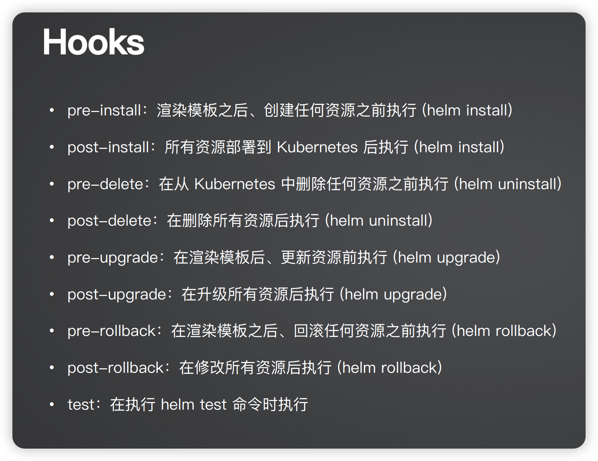

# aiops


## 安装k3s
- 安装ecs
- 安装k3s


```shell
export TF_VAR_secret_id=xxx
export TF_VAR_secret_key=xxx
root@devops-shawn-workspace:~/geekbang/aiops/module_3/install_k3s/dev# # terraform init
root@devops-shawn-workspace:~/geekbang/aiops/module_3/install_k3s/dev# # terraform plan
root@devops-shawn-workspace:~/geekbang/aiops/module_3/install_k3s/dev# # terraform apply -auto-approve
```
验证
```shell
root@devops-shawn-workspace:~/geekbang/aiops/module_3/install_k3s/dev# # export KUBECONFIG="$(pwd)/config.yaml"
root@devops-shawn-workspace:~/geekbang/aiops/module_3/install_k3s/dev# kubectl get ns 
NAME              STATUS   AGE
default           Active   53m
kube-node-lease   Active   53m
kube-public       Active   53m
kube-system       Active   53m
```

## 销毁资源
```shell
root@devops-shawn-workspace:~/geekbang/aiops/module_3/install_k3s/dev# # terraform state list 
root@devops-shawn-workspace:~/geekbang/aiops/module_3/install_k3s/dev# # terraform state rm module.k3s 
root@devops-shawn-workspace:~/geekbang/aiops/module_3/install_k3s/dev# # terraform destroy -auto-approve
```


## demo_app






```shell
root@devops-shawn-workspace:~/geekbang/aiops/module_3/demo_4# kubectl apply -f demo_app/k8s-specifications/
deployment.apps/db created
service/db created
deployment.apps/redis created
service/redis created
deployment.apps/result created
service/result created
deployment.apps/vote created
service/vote created
deployment.apps/worker created


root@devops-shawn-workspace:~/geekbang/aiops/module_3/demo_4# kubectl get svc 
NAME         TYPE        CLUSTER-IP      EXTERNAL-IP   PORT(S)          AGE
db           ClusterIP   10.43.152.2     <none>        5432/TCP         34s
kubernetes   ClusterIP   10.43.0.1       <none>        443/TCP          59m
redis        ClusterIP   10.43.94.77     <none>        6379/TCP         34s
result       NodePort    10.43.12.10     <none>        5001:31001/TCP   34s
vote         NodePort    10.43.122.148   <none>        5000:31000/TCP   33s


root@devops-shawn-workspace:~/geekbang/aiops/module_3/demo_4# cat ../install_k3s/dev/config.yaml | grep server
    "server": "https://47.76.68.129:6443"


浏览器访问：
http://47.76.68.129:31000
    
http://47.76.68.129:31001

```


```shell
root@devops-shawn-workspace:~/geekbang/aiops/module_3/demo_4# kubectl delete  -f demo_app/k8s-specifications/
deployment.apps "db" deleted
service "db" deleted
deployment.apps "redis" deleted
service "redis" deleted
deployment.apps "result" deleted
service "result" deleted
deployment.apps "vote" deleted
service "vote" deleted
deployment.apps "worker" deleted
```


# 服务间依赖问题如何解决?


• result 服务依赖于 postgres
• worker 服务依赖于 redis
• vote 服务虽然依赖于 redis，但仍能正常启动，因为当有请求时才需连接 redis


## 控制 Pod 启动顺序

 https://github.com/groundnuty/k8s-wait-for\

```shell
kubectl create role pod-reader --verb=get --verb=list --verb=watch --resource=pods,services,deployments

kubectl create rolebinding default-pod-reader --role=pod-reader --serviceaccount=default:default --namespace=default

```
### Example
```shell
    spec:
      initContainers:
        - name: wait-for-db
          image: ghcr.io/groundnuty/k8s-wait-for:v1.6
          imagePullPolicy: Always
          args:
            - "pod"
            - "-lapp=db"
```

```shell
root@devops-shawn-workspace:~/geekbang/aiops/module_3/demo_4# kubectl apply   -f demo_app_wait_for_db/k8s-specifications/
deployment.apps/db created
service/db created
deployment.apps/redis created
service/redis created
deployment.apps/result created
service/result created
deployment.apps/vote created
service/vote created
deployment.apps/worker created
root@devops-shawn-workspace:~/geekbang/aiops/module_3/demo_4# kubectl get pod 
NAME                      READY   STATUS     RESTARTS   AGE
db-94d855d54-x9cvz        0/1     Init:0/1   0          6s
redis-77fccb7f9-qrzgp     1/1     Running    0          5s
result-59998b6b57-cnnbv   0/1     Init:0/1   0          5s
vote-5655bd759-p79mh      1/1     Running    0          5s
worker-7dd74bcbbb-cxnkk   1/1     Running    0          5s
root@devops-shawn-workspace:~/geekbang/aiops/module_3/demo_4# kubectl logs result-59998b6b57-cnnbv -c wait-for-db
[2024-09-29 05:11:34] Waiting for pod -lapp=db...
[2024-09-29 05:11:36] Waiting for pod -lapp=db...
[2024-09-29 05:11:38] Waiting for pod -lapp=db...
[2024-09-29 05:11:40] Waiting for pod -lapp=db...
[2024-09-29 05:11:42] pod -lapp=db is ready.
root@devops-shawn-workspace:~/geekbang/aiops/module_3/demo_4# 

root@devops-shawn-workspace:~/geekbang/aiops/module_3/demo_4# kubectl delete   -f demo_app_wait_for_db/k8s-specifications/
```


## wait for flow
redis -> postgres -> worker -> vote -> result

```shell
root@devops-shawn-workspace:~/geekbang/aiops/module_3/demo_4# kubectl apply   -f demo_app_wait_for_flow/k8s-specifications/
root@devops-shawn-workspace:~/geekbang/aiops/module_3/demo_4# root@devops-shawn-workspace:~/geekbang/aiops/module_3/demo_4# 
root@devops-shawn-workspace:~/geekbang/aiops/module_3/demo_4# kubectl get pod
NAME                      READY   STATUS     RESTARTS   AGE
db-dff966c7b-46djl        1/1     Running    0          10s
redis-77fccb7f9-p8wt9     1/1     Running    0          9s
result-68b7f74f57-9cplh   0/1     Init:0/1   0          9s
vote-7746bc59d9-4rdfv     0/1     Init:0/1   0          9s
worker-576fdb7856-mjhx7   1/1     Running    0          9s

root@devops-shawn-workspace:~/geekbang/aiops/module_3/demo_4# 
root@devops-shawn-workspace:~/geekbang/aiops/module_3/demo_4# kubectl logs db-dff966c7b-46djl      -c wait-for-redis
[2024-09-29 05:19:31] Waiting for pod -lapp=redis...
[2024-09-29 05:19:33] pod -lapp=redis is ready.
root@devops-shawn-workspace:~/geekbang/aiops/module_3/demo_4# 
root@devops-shawn-workspace:~/geekbang/aiops/module_3/demo_4# kubectl logs worker-576fdb7856-mjhx7      -c wait-for-db
[2024-09-29 05:19:31] Waiting for pod -lapp=db...
[2024-09-29 05:19:34] Waiting for pod -lapp=db...
[2024-09-29 05:19:36] pod -lapp=db is ready.
root@devops-shawn-workspace:~/geekbang/aiops/module_3/demo_4# 
root@devops-shawn-workspace:~/geekbang/aiops/module_3/demo_4# kubectl logs vote-7746bc59d9-4rdfv     -c wait-for-worker
[2024-09-29 05:19:32] Waiting for pod -lapp=worker...
[2024-09-29 05:19:34] Waiting for pod -lapp=worker...
[2024-09-29 05:19:36] Waiting for pod -lapp=worker...
[2024-09-29 05:19:38] Waiting for pod -lapp=worker...
[2024-09-29 05:19:40] pod -lapp=worker is ready.
root@devops-shawn-workspace:~/geekbang/aiops/module_3/demo_4# kubectl logs result-68b7f74f57-9cplh     -c wait-for-vote
[2024-09-29 05:19:31] Waiting for pod -lapp=vote...
[2024-09-29 05:19:33] Waiting for pod -lapp=vote...
[2024-09-29 05:19:35] Waiting for pod -lapp=vote...
[2024-09-29 05:19:38] Waiting for pod -lapp=vote...
[2024-09-29 05:19:40] Waiting for pod -lapp=vote...
[2024-09-29 05:19:42] Waiting for pod -lapp=vote...
[2024-09-29 05:19:44] pod -lapp=vote is ready.
root@devops-shawn-workspace:~/geekbang/aiops/module_3/demo_4# 

root@devops-shawn-workspace:~/geekbang/aiops/module_3/demo_4# kubectl delete    -f demo_app_wait_for_flow/k8s-specifications/
```


# helm 使用

Chart
K8s 应用安装包，包含应用的 K8s 对象
用于创建实例


Release
使用默认或特定参数安装的 Helm 实例
（运行中的实例）


Repository
用于存储和分发的HelmChart 仓库（Git、OCI）


## Helm 常用命令
• install：安装 Helm Chart
• get, status, list：获取 Helm Release 的信息，例如安装状态、日志、安装参数等• uninstall：卸载 Helm Release
• repo add, repo list, repo remove, repo index： Repository 相关命令
• search：在 Repository 中查找 Helm Chart
• create, package：创建和打包 Helm Chart
• pull：拉取 helm chart


```shell
#创建demo chart
root@devops-shawn-workspace:~/geekbang/aiops/module_3/demo_5# helm create demo
Creating demo

#本地渲染出来，调试
root@devops-shawn-workspace:~/geekbang/aiops/module_3/demo_5# helm inspect values oci://registry-1.docker.io/bitnamicharts/redis


#远端渲染出来，调试
root@devops-shawn-workspace:~/geekbang/aiops/module_3/demo_5# helm template ./demo

#创建一个nginx release
root@devops-shawn-workspace:~/geekbang/aiops/module_3/demo_5# helm install nginx ./demo -n nginx --create-namespace --set image.tag='latest'
NAME: nginx
LAST DEPLOYED: Sun Sep 29 13:45:42 2024
NAMESPACE: nginx
STATUS: deployed
REVISION: 1
NOTES:
1. Get the application URL by running these commands:
  export POD_NAME=$(kubectl get pods --namespace nginx -l "app.kubernetes.io/name=demo,app.kubernetes.io/instance=nginx" -o jsonpath="{.items[0].metadata.name}")
  export CONTAINER_PORT=$(kubectl get pod --namespace nginx $POD_NAME -o jsonpath="{.spec.containers[0].ports[0].containerPort}")
  echo "Visit http://127.0.0.1:8080 to use your application"
  kubectl --namespace nginx port-forward $POD_NAME 8080:$CONTAINER_PORT


root@devops-shawn-workspace:~/geekbang/aiops/module_3/demo_5# helm list -n nginx
NAME    NAMESPACE       REVISION        UPDATED                                 STATUS          CHART           APP VERSION
nginx   nginx           1               2024-09-29 13:45:42.959631641 +0800 CST deployed        demo-0.1.0      1.16.0  

root@devops-shawn-workspace:~/geekbang/aiops/module_3/demo_5# kubectl get pod -n nginx 
NAME                          READY   STATUS    RESTARTS   AGE
nginx-demo-769fc777cd-rj4f8   1/1     Running   0          64s

#升级安装 (常用)
root@devops-shawn-workspace:~/geekbang/aiops/module_3/demo_5# helm upgrade --install nginx ./demo -n nginx --create-namespace --set image.tag='latest'
 
#从远端仓库安装
#release_name=ingress-nginx(第一个)
#chart_name=ingress-nginx（第二个）
helm upgrade --install ingress-nginx ingress-nginx --repo https://kubernetes.github.io/ingress-nginx --namespace ingress-nginx --create-namespace
root@devops-shawn-workspace:~/geekbang/aiops/module_3/demo_5# helm list -n ingress-nginx
NAME            NAMESPACE       REVISION        UPDATED                                 STATUS          CHART                   APP VERSION
ingress-nginx   ingress-nginx   1               2024-09-29 13:56:06.03305303 +0800 CST  deployed        ingress-nginx-4.11.2    1.11.2 

```

Demo: 将示例应用修改为 Helm
• 要抽哪些变量和模板？
• Secret、ConfigMap 等配置文件
• 如何调试？
• helm template . 
• helm inspect values oci://registry-1.docker.io/bitnamicharts/redis
• 多环境问题如何处理？
• 使用不同的 values.yaml 文件
• 生产环境下如何控制不部署中间件？
• 使用 conditions


```shell
root@devops-shawn-workspace:~/geekbang/aiops/module_3/demo_6# helm upgrade --install vote-helm ./  -n vote-helm --create-namespace 
Release "vote-helm" does not exist. Installing it now.
NAME: vote-helm
LAST DEPLOYED: Sun Sep 29 14:21:40 2024
NAMESPACE: vote-helm
STATUS: deployed
REVISION: 1
TEST SUITE: None
root@devops-shawn-workspace:~/geekbang/aiops/module_3/demo_6# helm list -n  vote-helm 
NAME            NAMESPACE       REVISION        UPDATED                                 STATUS          CHART           APP VERSION
vote-helm       vote-helm       1               2024-09-29 14:21:40.000062011 +0800 CST deployed        vote-0.1.0      0.1.0      
root@devops-shawn-workspace:~/geekbang/aiops/module_3/demo_6# 

root@devops-shawn-workspace:~/geekbang/aiops/module_3/demo_6# helm uninstall  vote-helm   -n vote-helm   
release "vote-helm" uninstalled

```


Helm 高级核心技术• 内置变量和函数
• https://helm.sh/docs/chart_template_guide/builtin_objects/
• https://helm.sh/docs/chart_template_guide/function_list
• 依赖
• https://helm.sh/docs/helm/helm_dependency
• 渲染和调试
• helm template . --debug
• Helm Hooks
• https://helm.sh/docs/topics/charts_hooks/
• pre-install、post-install、pre-delete、post-delete、pre-upgrade、post-upgrade、pre-rollback、postrollback

使用第三方包
• GitHub
• https://github.com/bitnami/charts
• Artifact Hub
• https://artifacthub.io/


```shell
root@devops-shawn-workspace:~/geekbang/aiops/module_3/demo_7# helm dependency update
Hang tight while we grab the latest from your chart repositories...
...Successfully got an update from the "xiaopengfeik8s" chart repository
...Successfully got an update from the "argo" chart repository
Update Complete. ⎈Happy Helming!⎈
Saving 2 charts
Downloading redis from repo oci://registry-1.docker.io/bitnamicharts
Pulled: registry-1.docker.io/bitnamicharts/redis:17.16.0
Digest: sha256:2ac70a7a7aa27e71d05bf95dbf898c9c3901494963070788bfd5eeec65567493
Downloading postgresql-ha from repo oci://registry-1.docker.io/bitnamicharts
Pulled: registry-1.docker.io/bitnamicharts/postgresql-ha:11.9.0
Digest: sha256:099ad0a22567f340b7fe772b50431e9b1eb4bcd56faacccfaf320ce62a576e29
Deleting outdated charts


root@devops-shawn-workspace:~/geekbang/aiops/module_3/demo_7# helm upgrade --install vote-helm ./  -n vote-helm --create-namespace 
Release "vote-helm" does not exist. Installing it now.
NAME: vote-helm
LAST DEPLOYED: Sun Sep 29 14:29:40 2024
NAMESPACE: vote-helm
STATUS: deployed
REVISION: 1
TEST SUITE: None

root@devops-shawn-workspace:~/geekbang/aiops/module_3/demo_7# kubectl get pod -n vote-helm 
NAME                         READY   STATUS    RESTARTS   AGE
db-pgpool-5cfc9684c9-sqdsg   1/1     Running   0          107s
db-postgresql-0              1/1     Running   0          106s
db-postgresql-1              1/1     Running   0          106s
db-postgresql-2              1/1     Running   0          106s
redis-master-0               1/1     Running   0          106s
redis-replicas-0             1/1     Running   0          106s
redis-replicas-1             1/1     Running   0          52s
redis-replicas-2             1/1     Running   0          26s
result-55585899f6-bh62r      1/1     Running   0          107s
vote-944ffb7d-pscn4          1/1     Running   0          107s
worker-5878d7c555-5skj6      1/1     Running   0          107s
```







## Helm Cheat Sheet
```shell
# 安装 Helm Chart 或者执行升级，无需担心重复执行问题
$ helm upgrade --install <release name> --values <values file> <chart directory>
# 查看 Helm Chart values.yaml 配置信息
$ helm inspect values <CHART>
# 查看 Helm Repository Chart 列表
$ helm repo list
# 查看所有命名空间的 release
$ helm list --all-namespaces
# 升级应用前先更新依赖
$ helm upgrade <release> <chart> --dependency-update
# 回滚应用
$ helm rollback <release> <revision>


```


